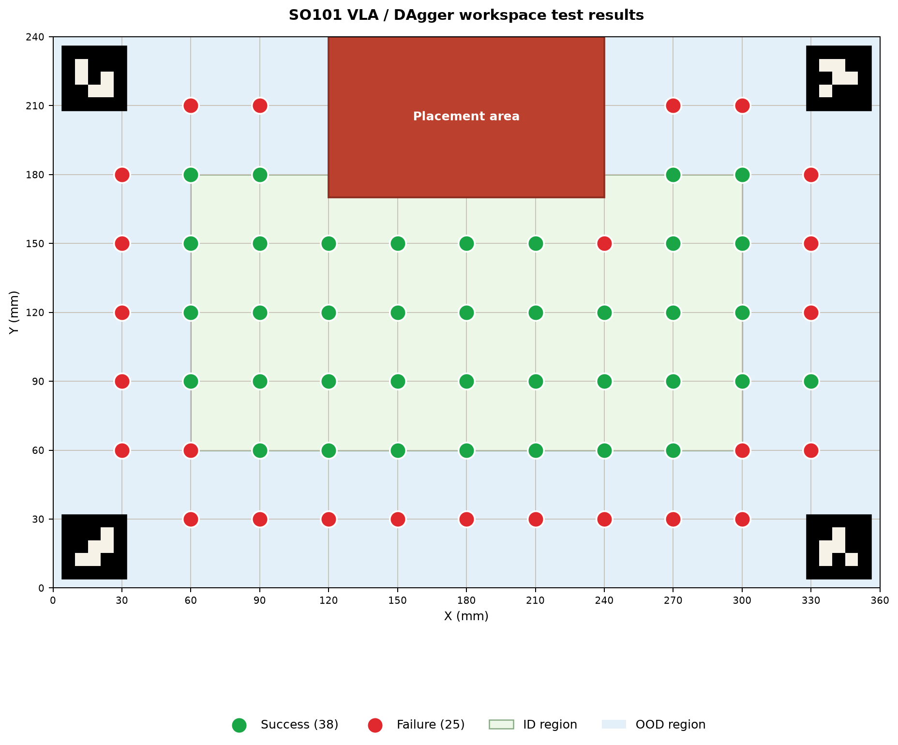
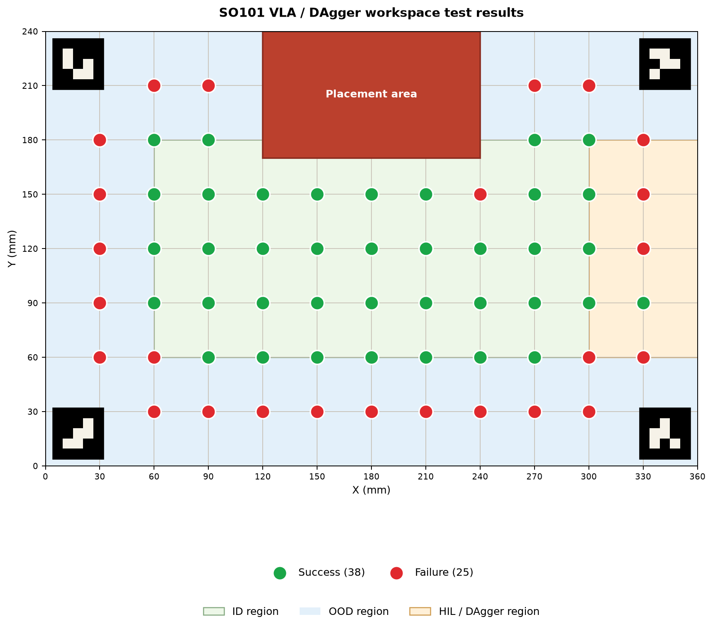

# Spatial Generalization and DAgger-Based Correction for SmolVLA on SO-ARM101

## Abstract

This report evaluates spatial generalization of a SmolVLA visuomotor policy on a LeRobot SO-ARM101 manipulator. The task is to pick a cube placed at discrete locations on a 360 mm × 240 mm tabletop and place it in a central red target area. We first train the policy on 100 imitation-learning demonstrations collected inside an in-distribution (ID) region. We then collect 20 additional human-in-the-loop (HIL) demonstrations with DAgger after observing grasp failures in the right-hand out-of-distribution (OOD) region, retrain the policy, and repeat the spatial evaluation.

The initial policy is reliable within the ID region (37/40 successful test locations, 92.5%) but performs poorly outside it. DAgger improves the specifically covered HIL region from 5/10 to 7/10 successful locations. However, the post-HIL policy shows a decline in ID-region reliability (from 92.5% to 85.0%) and less consistent retry-based self-correction near the ID/OOD boundary. These findings illustrate both the value and the trade-off of targeted corrective data collection in a small-data VLA setting.

## 1. Objective

The objective was to answer two practical questions:

1. How well does a SmolVLA policy trained only on demonstrations from a central workspace region generalize to spatially shifted cube locations?
2. Can targeted DAgger/HIL demonstrations improve performance in a known failure region without degrading performance elsewhere?

## 2. System and Task Setup

### Hardware and policy

- Robot: LeRobot SO-ARM101 manipulator.
- Policy: SmolVLA.
- Object: a cube placed at predefined tabletop locations.
- Task: grasp the cube and place it in the central red placement area.

### Workspace

The tabletop workspace measures 360 mm × 240 mm and is divided into a 12 × 8 grid with a 30 mm spacing. Test positions are restricted to grid intersections. Four corner fiducials define the workspace frame, while the red rectangle marks the placement area.

For analysis, the workspace is partitioned as follows:

| Region | Bounds in workspace coordinates | Meaning |
| --- | --- | --- |
| ID | `60 ≤ x ≤ 300 mm`, `60 ≤ y ≤ 180 mm` | Region represented by the original imitation-learning data |
| OOD | All remaining test locations | Locations outside the original ID region |
| HIL / DAgger | `300 ≤ x ≤ 360 mm`, `60 ≤ y ≤ 180 mm` | Right-side region where corrective HIL data were collected |

The HIL rectangle shares the `x = 300 mm` boundary with the ID definition. It is displayed as a separate overlay because it denotes the region that received additional DAgger data.

## 3. Experimental Design

### Experiment 1: ID-only imitation learning

One hundred demonstrations were collected from the ID region and used to train the initial SmolVLA policy. The trained policy was evaluated across the predefined spatial test set.

### Experiment 2: Targeted DAgger correction

When the initial policy failed to grasp cubes in the right-side OOD region, a human operator took over and provided corrective trajectories. Twenty additional HIL demonstrations were collected, merged with the original dataset, and used for retraining. The retrained policy was evaluated with the same spatial protocol.

## 4. Evaluation Protocol

At each grid-intersection location, the robot attempted the task three times.

- A single trial could include up to three automatic grasp retries.
- If the cube was not grasped within those three retries, that trial was recorded as a failure.
- Each location was repeated three times.
- A location was marked **successful** only if all three repeats succeeded; if any repeat failed, the location was marked **failed**.

This is a conservative, location-level metric: it emphasizes repeatability rather than the average outcome of individual attempts.

## 5. Results

### 5.1 Spatial outcome maps

#### Baseline: ID-only imitation learning



*Figure 1. Baseline policy results. Green dots indicate successful locations and red dots indicate failed locations. The ID region is shown in light green and the OOD region in light blue.*

#### After HIL/DAgger data collection and retraining



*Figure 2. Results after adding DAgger/HIL demonstrations. The light orange region identifies the right-side area covered by corrective training data.*

### 5.2 Quantitative summary

The result JSON files contain 63 evaluated locations for each condition. The table below reports the number of successful locations divided by the number of tested locations.

| Condition | All locations | ID region | HIL / DAgger region | OOD complement |
| --- | ---: | ---: | ---: | ---: |
| ID-only policy | 38/63 (60.3%) | 37/40 (92.5%) | 5/10 (50.0%) | 1/23 (4.3%) |
| After HIL / DAgger | 38/63 (60.3%) | 34/40 (85.0%) | 7/10 (70.0%) | 4/23 (17.4%) |

The HIL region overlaps the ID boundary at `x = 300 mm`; therefore, the regional columns are descriptive overlays and should not be summed to reconstruct the overall total.

## 6. Observations

### Baseline behavior

The ID-only policy was approximately 90% reliable in the ID region, consistent with the measured 92.5% location-level success rate. It also showed useful self-correction: when the first grasp attempt missed, the second or third automatic retry often recovered the object. In contrast, performance dropped sharply for spatial locations outside the training distribution, particularly on the right-hand side.

### Effect of HIL / DAgger data

After targeted HIL collection and retraining, the right-side HIL region became substantially more reliable: success increased from 50.0% to 70.0%. The broader OOD complement also improved, from 4.3% to 17.4%, although it remained much less reliable than the ID region.

The improvement was accompanied by a cost. The ID-region success rate fell from 92.5% to 85.0%, and locations close to the OOD boundary exhibited random failures after HIL retraining. The observed retry-based self-correction also appeared weaker in this boundary-adjacent area.

## 7. Discussion

The results support the expected role of DAgger: targeted corrective demonstrations can improve performance where the policy's original state-action distribution is insufficient. The improvement in the HIL region shows that the policy can benefit from human intervention precisely at failure states.

At the same time, the ID degradation suggests that the extra 20 trajectories changed the training distribution enough to affect previously stable behavior. Possible contributors include the small size of both datasets, an imbalance between original and corrective trajectories, insufficient coverage around the ID/OOD transition, or retraining hyperparameters that do not preserve prior behavior.

The unchanged global success rate (38/63 in both conditions) is an important warning: overall accuracy alone would hide the useful OOD improvement and the ID regression. Region-aware evaluation is therefore necessary for this task.

## 8. Limitations and Next Steps

1. The evaluation uses a modest number of discrete locations, and each location-level label is based on only three repeats.
2. The HIL region overlaps the ID boundary, so future experiments should define disjoint regions or report boundary locations separately.
3. The report uses binary location-level success. Logging per-attempt success, retry count, grasp latency, and placement accuracy would make the self-correction analysis quantitative.
4. Future DAgger rounds should add samples on both sides of the ID/OOD boundary and retain a balanced replay mix of the original ID demonstrations and HIL demonstrations.
5. A held-out set of repeated trials should be used to estimate confidence intervals before drawing stronger conclusions about regression or improvement.

## 9. Reproducing the Figures

The plotting utility and its JSON inputs are located in `report/`.

```bash
cd report

# Baseline map with ID/OOD overlay
python3 plot_workspace_results.py \
  --json base_test_results.json \
  --show-id-ood \
  --output ../assets/base_results_region.png

# HIL/DAgger map with all three region overlays
python3 plot_workspace_results.py \
  --json hil_test_results.json \
  --show-hil \
  --output ../assets/hil_result_region.png
```

The location outcomes are stored in `report/base_test_results.json` and `report/hil_test_results.json`.
